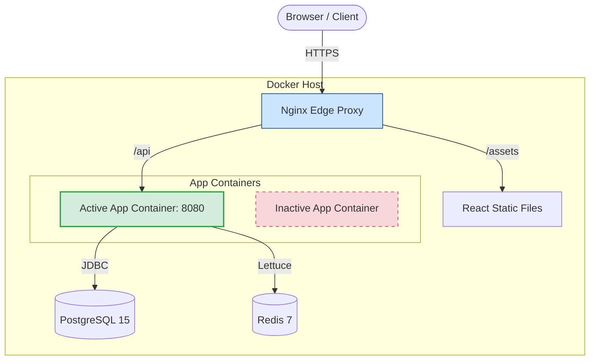

# Course Management API

<div align="center">

  [](https://java.com/)
  [](https://spring.io/projects/spring-boot)
  [](https://react.dev/)
  [](https://www.postgresql.org/)
  [](https://redis.io/)
  [](https://opensource.org/licenses/MIT)

  **A production-grade, highly-concurrent course management platform with role-based access control and zero-downtime deployments.**
</div>

---

> [!NOTE]  
> **Project Status:** The deployment infrastructure (Blue-Green CI/CD, Nginx, Let's Encrypt automation) is fully implemented and deployment-ready. The production deployment is currently **inactive** and not hosted. URLs referenced in documentation (e.g., `api.nishantdd.dev`) are architectural examples.

## 🚀 Overview

The **Course Management API** is a full-stack platform built to handle the complexities of concurrent user enrollment and high-traffic edge cases. It is designed with mature backend patterns typically found in enterprise systems, paired with a modern React SPA and a robust, automated infrastructure pipeline.

Whether you are an `ADMIN` managing the platform, an `INSTRUCTOR` publishing courses, or a `STUDENT` securing a limited seat in a high-demand class, the system guarantees data consistency, high availability, and rapid responses.

## 🛠 Engineering Highlights

This repository serves as a demonstration of production-ready software engineering, focusing on reliability, scalability, and security:

- **Distributed Rate Limiting:** Implemented via [Bucket4j + Redis](docs/rate-limiting.md) to protect endpoints dynamically based on user roles (e.g., standard users vs. admins).
- **Pessimistic Concurrency Control:** Write locks on course seats ensure zero over-enrollment during high-traffic registration spikes.
- **Two-Level Caching Architecture:** Uses Caffeine (L1) for near-instant reads and Redis (L2) for distributed consistency, synchronized via Pub/Sub.
- **Zero-Downtime Blue-Green Deployments:** A custom [bootstrap and deployment script](docs/deployment.md) seamlessly swaps active Docker containers behind an Nginx reverse proxy.
- **Stateless JWT Authentication:** Access and refresh token flows backed by a Redis blacklist for immediate session invalidation on logout.
- **Structured Observability:** Trace IDs injected via MDC across the entire request lifecycle, ensuring seamless log aggregation and debugging.

## ✨ Core Features

| Feature | Details |
| :--- | :--- |
| 🛡 **Role-Based Access Control** | Distinct permissions for `ADMIN`, `INSTRUCTOR`, and `STUDENT` personas. |
| 🎓 **Course Lifecycle** | Instructors can draft, publish, and manage seat capacities dynamically. |
| 💳 **Safe Enrollments** | Students can claim seats without race conditions disrupting availability. |
| 🌐 **Modern Frontend** | A fast, responsive React 19 SPA powered by Vite and Tailwind CSS. |
| 🐳 **Containerized Infra** | One-command provisioning for PostgreSQL, Redis, and Nginx. |
| 📜 **API Documentation** | Interactive Swagger UI available out-of-the-box. |

## 🏗 System Architecture

The infrastructure uses a classic edge-proxy topology for reverse routing and TLS termination, routing API traffic to the currently active application container (Blue or Green).



For an in-depth look at package structures, domain models, and request processing, refer to the [Architecture Documentation](docs/architecture.md).

## ⚡ Quick Start (Docker)

The fastest way to run the application is via Docker Compose.

**Prerequisites:** Docker, Git.

### 1. Clone & Configure

```bash
git clone https://github.com/nishant-dd-24/course-management-api.git
cd course-management-api
cp .env.example .env
```
*(Open `.env` and set `SPRING_DATASOURCE_PASSWORD` and a 32-byte Base64 `JWT_SECRET`)*

### 2. Start the Stack

```bash
# Starts PostgreSQL, Redis, and the Spring Boot API with hot-reload enabled
docker compose -f docker-compose.dev.yml up --build -d
```
The API is now running at `http://localhost:8080`.

### 3. Run the Frontend

Requires Node 22+.

```bash
cd frontend
npm install
npm run dev
```
Access the application at `http://localhost:5173`.

> [!TIP]
> Prefer to run the Java app manually via Maven? Check the [Local Development Guide](docs/local-development.md).

## 📚 Documentation Hub

We maintain comprehensive documentation for every layer of the stack. 

| Category | File | Description |
| :--- | :--- | :--- |
| **System** | [Architecture](docs/architecture.md) | Package structure, domain models, and service boundaries |
| **System** | [Request Flow](docs/request-flow.md) | Filter chain, per-request processing pipeline |
| **System** | [Design Decisions](docs/design-decisions.md) | The *why* behind our technical choices |
| **Deep Dive** | [Caching](docs/caching.md) | Two-level cache strategy and Pub/Sub sync |
| **Deep Dive** | [Concurrency](docs/concurrency.md) | Pessimistic locking for safe seat allocation |
| **Deep Dive** | [Rate Limiting](docs/rate-limiting.md) | Bucket4j implementation and endpoint limits |
| **Deep Dive** | [Observability](docs/observability.md) | MDC logging and `@Loggable` instrumentation |
| **Deep Dive** | [Session Management](docs/session-management.md) | JWT design and Redis token storage |
| **Deep Dive** | [Error Handling](docs/error-handling.md) | Global handler, error schema, 401/403 dual coverage |
| **DevOps** | [Deployment](docs/deployment.md) | Nginx proxy, Let's Encrypt automation, and bootstrap |
| **DevOps** | [CI/CD](docs/cicd.md) | GitHub Actions and Blue-Green deploy scripts |
| **Reference** | [API Endpoints](docs/api.md) | Complete REST API schemas and role requirements |
| **Reference** | [Frontend](frontend/README.md) | Frontend setup, pages, auth flow, and build instructions |
| **Reference** | [Testing](docs/testing.md) | Unit, integration, and Testcontainers setup |
| **Reference** | [Local Development](docs/local-development.md) | Manual database and application setup instructions |
| **Reference** | [Troubleshooting](docs/troubleshooting.md) | Common errors and resolutions |

## 🛣 Roadmap

- [ ] **State Machine Enforcement**: Stricter guards for `PENDING_PAYMENT → ACTIVE` enrollment states.
- [ ] **Async Event Pipeline**: Offload post-mutation side effects (e.g., emails) from the request thread.
- [ ] **Observability Uplift**: Migrate to OpenTelemetry tracing and Prometheus metrics.
- [ ] **Frontend Testing**: Introduce Cypress/Playwright integration tests for the React SPA.

## 📄 License

This project is licensed under the MIT License. See the [LICENSE](LICENSE) file for details.

---
<div align="center">
  Built by <a href="https://github.com/nishant-dd-24">Nishantkumar Dwivedi</a>
</div>
